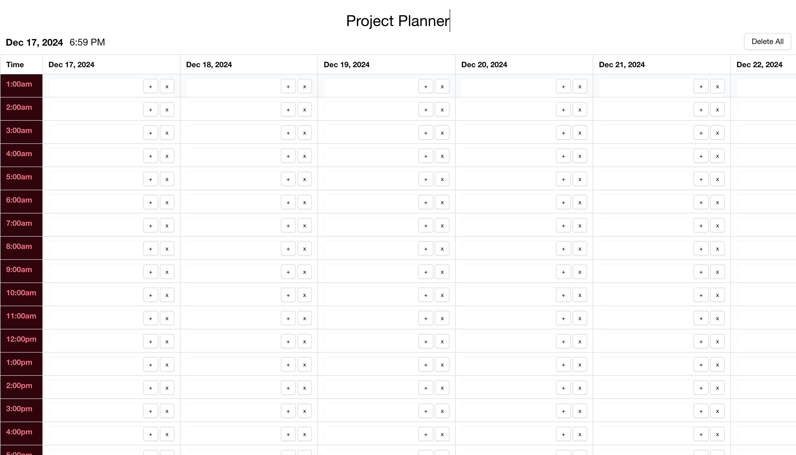
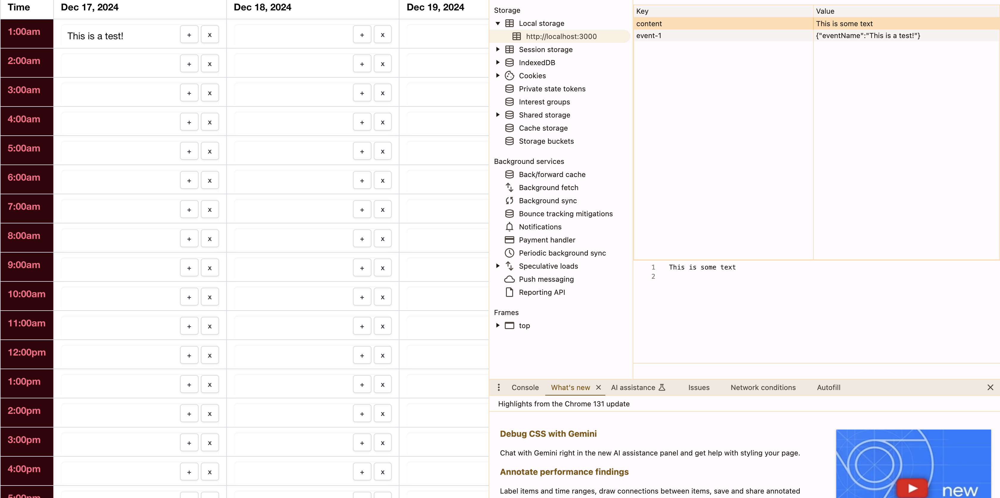

# Project Planner Refactor

## Table of Contents

* [Introduction](#introduction)
* [Features](#features)
* [Installation](#installation)
* [Technologies Used](#technologies-used)
* [Usage](#usage)
* [Screenshots](#screenshots)
* [Future Developments](#future-developments)
* [Contact](#contact)
* [Contributions](#contributions)
* [License](#license)
* [Demo](#demo)

## Introduction

This React Application refactors a previous planner project to expand planning to include user’s week. Through the utilization of modern technologies, this application is able to appear more polished, professional, and intuitive user experience!

## Features

* Contains an organized agenda structure.
* Includes the current date and time.
* Planner is structured into time blocks for twentry-four hours of that day.
* Includes time blocks for twenty-four hours of the day for seven days of the upcomming week.
* Includes color coding to indicate whether each individual time block is in the past, present, or future.
* Ensures each time block allows an event to be entered.
* When an event is saved using the save button, it is saved to local storage.
* Ensures when the page is reloaded, saved events are rendered in their appropriate time blocks.
* Includes a CSS header animation to enable enhanced user functionality.

## Installation

This project can be accessed via the live demo link or locally by following these steps:

1. Clone the repository to your local machine.
2. Install the necessary dependencies by running npm install.
3. Start the application by running npm run start in your terminal.

## Technologies Used

* React Library
* Bulma Framework
* DayJs Library
* CSS Animations
* Local Storage

## Usage

Navigate to the homepage:

* Indentify the current date and time at the top of the application.
* Select a day of the upcomming week or the current day.
* Choose a time block to select and enter an event.
* Click the save button to the right of the time block .
* Close browser or reload browser and indentify that the saved event is still present in its correct time block and date.
* Navigate to developer tools under the application tab to indetify the saved event is located under local storage. 

## Screenshots

### Initial Application Screen

### Added Time Event

### Added Event in Local Storage

## Future Developments

* Add a toggle light and dark button to enhance accessibility.
* Add further scalability to application.
* Add more CSS animations that enhance user experience and interactivity.

## Contact

If there are any questions or feedback, feel free to reach out via: 

* Github Issues: [Github](http://Github.com/Taylor-Brandon)

* Email: [Email](mailto://taylorbrandon.dev@gmail.com)

## Contributions

Special thanks to Columbia Bootcamps for providing the educational resources necessary to complete this project.

## License

## Demo

Find the Live Demo: [Here](https://taylor-brandon.github.io/Project-Planner-Refactor/)